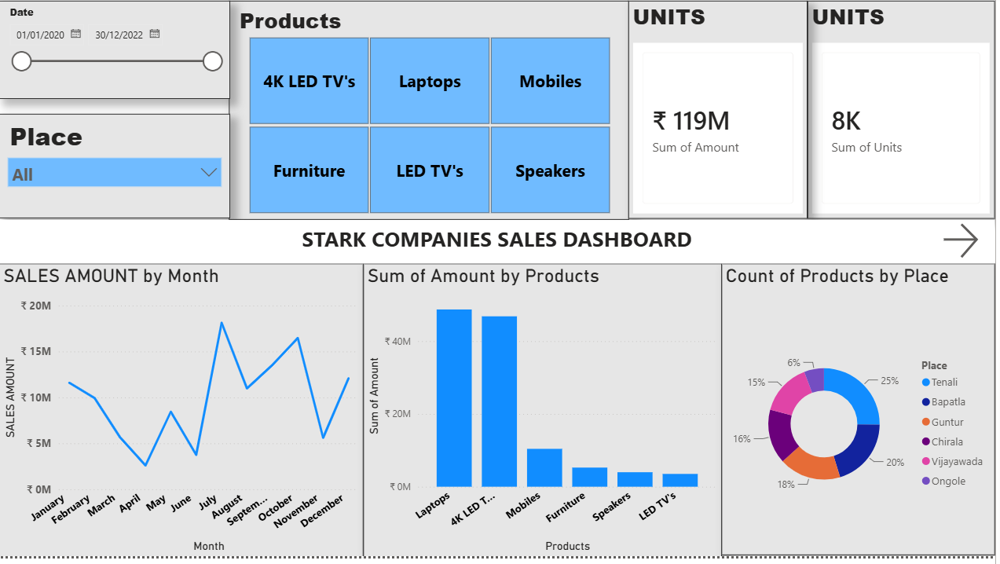
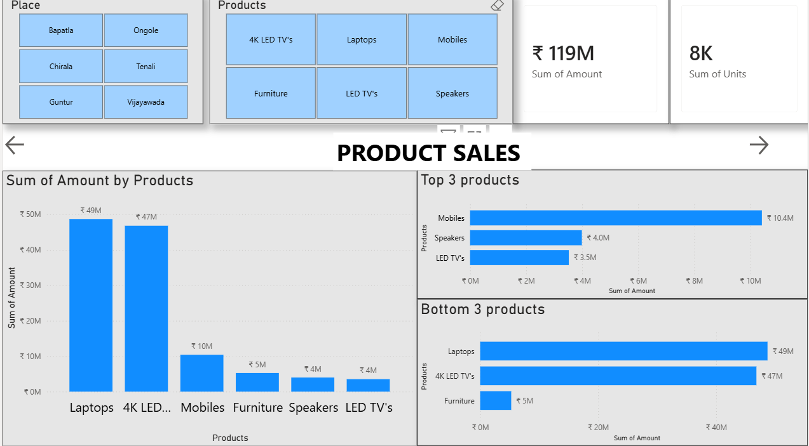
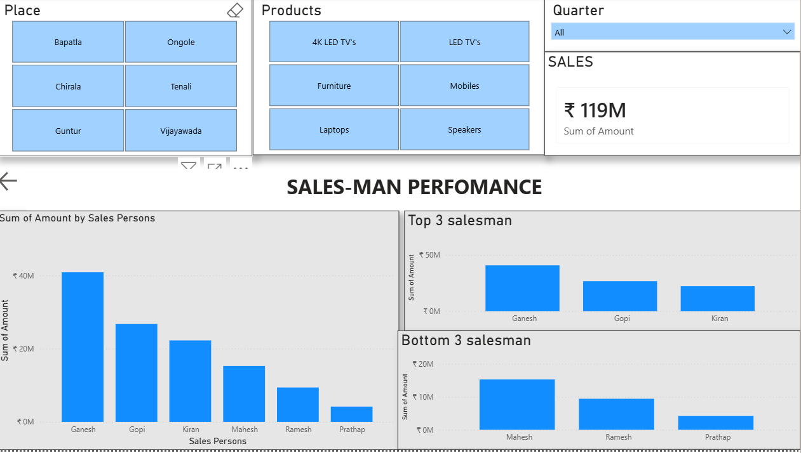

📊 Sales Analysis – SQL & Power BI

1. Project Overview

This project analyzes sales data using SQL and Power BI to identify
sales trends, product performance, regional performance, and salesperson
performance.

SQL was used to query and analyze the dataset, while Power BI was used
to build an interactive multi-page dashboard for presenting the results.

2. 🛠 Tools Used

- MySQL
- Power BI
- Excel
- SQL
- GitHub

3. 📁 Dataset

The dataset contains sales transactions from 2020 to 2022.

Main columns:

- Date
- Sales Persons
- Products
- Place
- Price
- Units
- Amount

The dataset contains multiple product categories including:

- Laptops
- 4K LED TVs
- Mobiles
- Furniture
- Speakers
- LED TVs

4. 🔍 SQL Analysis

SQL queries were written to answer business questions such as:

1. What is the total sales revenue?
2. How many units were sold?
3. What is the revenue generated by each product?
4. How much revenue did each salesperson generate?
5. What is the sales performance of each location?
6. Which product sold the most units?
7. Which salesperson generated the highest revenue?
8. Which location generated the highest revenue?
9. How do sales change month by month?
10. How do yearly sales compare?
11. What is the average transaction value?
12. What is the average transaction value by product?
13. How does each product perform across locations?
14. Which transactions are above the overall average?
15. How do salespeople rank based on total revenue?

5. 💻 SQL Concepts Demonstrated

The analysis demonstrates:

- SELECT
- WHERE
- SUM()
- AVG()
- GROUP BY
- ORDER BY
- LIMIT
- YEAR()
- MONTH()
- Multiple-column grouping
- Subqueries
- Window Functions
- RANK()

6. 📈 Power BI Dashboard

An interactive Power BI dashboard was created using the same sales
dataset analyzed with SQL.

# Main Sales Dashboard

Provides an overall view of:

- Total Sales
- Total Units Sold
- Monthly Sales Trend
- Sales by Product
- Product Distribution by Place
- Date and Place Filters

# Product Sales Analysis

Provides product-level analysis including:

- Sales by Product
- Product comparison
- Top products
- Bottom products
- Product and Place filters

# Salesperson Performance

Analyzes individual salesperson performance including:

- Revenue by Salesperson
- Top-performing Salespeople
- Bottom-performing Salespeople
- Product, Place, and Quarter filters

---

7. 📌 Dashboard Highlights

- Total sales analyzed: approximately ₹119M
- Approximately 8K units represented in the dashboard
- Laptops and 4K LED TVs account for a large share of revenue
- Sales performance varies considerably across months
- Salesperson performance can be compared and ranked
- Interactive slicers allow analysis by date, product, place, and quarter

---

8. 📂 Project Structure

Sales-Analysis-SQL-PowerBI/
│
├── README.md
├── SQL/
│   └── sales_analysis.sql
│
├── Dataset/
│   └── sales_data.xlsx
│
├── PowerBI/
│   └── sales_dashboard.pbix
│
└── images/
    ├── main-dashboard.png
    ├── product-sales.png
    └── salesperson-performance.png

---

9. 🎯 Project Objective

The objective of this project is to demonstrate an end-to-end data
analysis workflow by combining SQL-based analysis with interactive
Power BI visualization.

The project demonstrates the ability to transform raw sales data into
business-focused insights using SQL queries and dashboards.

